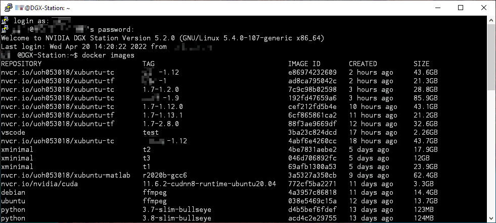
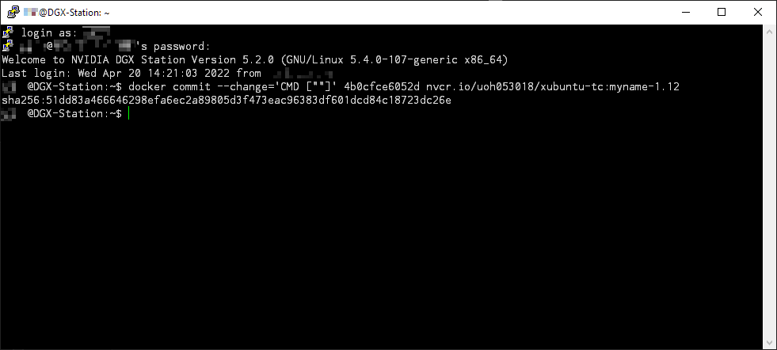
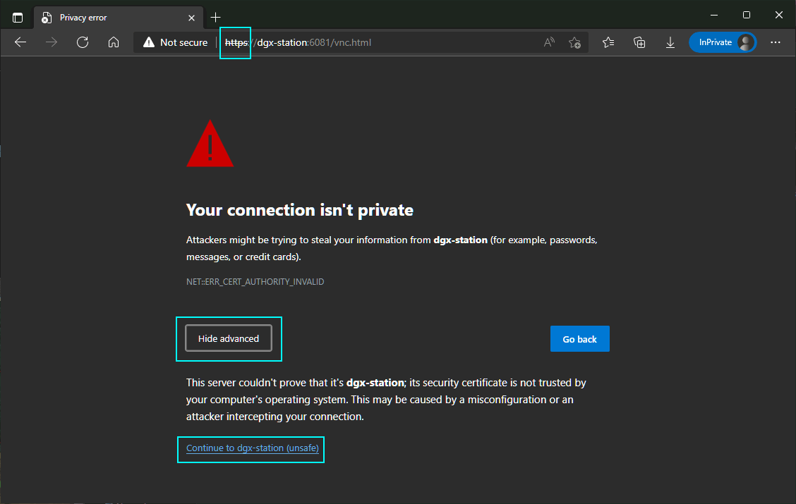
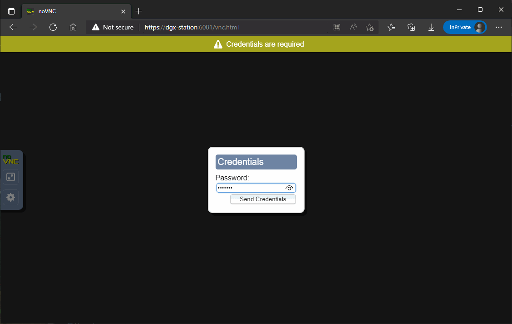
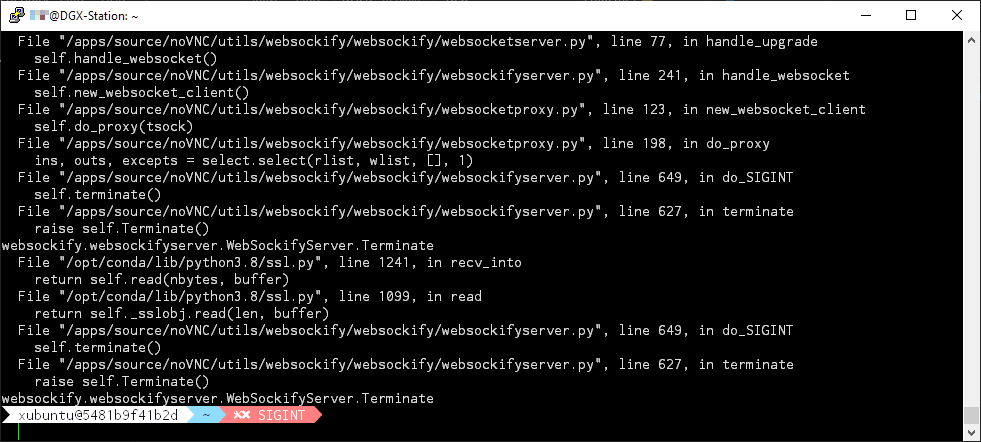
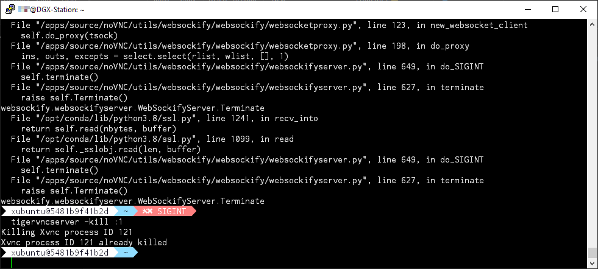
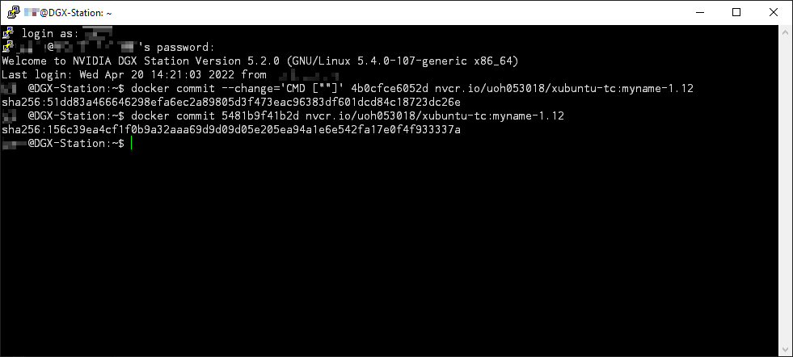

# Dockerfile Collection for DGX-230

To get back to the main page, click [here](../index).

To view the list of image building, click [here](../dockerlist).

To view the basic manual, click [here](../manual).

To view extra manuals about xUbuntu, click [here](../manual-xubuntu).

To view the **contents** of these manuals, click [here](../manual-session).

## Workflow of working with a new image

> * Updated on 4/20/2022
> * Should work with ver 1.6+ images

The following guides will show you how to open a new image in the interactive mode, work with the image, and save the image correctly.

### Initialization

Since ver 1.6 desktop images, all images are properly equipped with user authority. To make the container-inside image has a consistent authority configuration, every time you work with a new image, you are required to perform the initialization.

* **Step 1**: Open a new Putty session (in the following steps, we may need to open the second session with the first session remained open). Use `docker images` to view all images that you can use.

    |   Step 1 (In Putty Session 1)  |
    | :----------------------------: |
    |  |

    All public images should be named as `nvcr.io/uoh053018/*******:1.x-x.x.x` The part before the `:` symbol is the repository name, and the latter part is the image tag. A whole image name is constructed by the repository name and the image tag.

* **Step 2**: Select a public image, and run the initialization command for it:

    |   Step 2 (In Putty Session 1)  |
    | :----------------------------: |
    |  |

    ```bash
    docker run --gpus all -it --rm <name>:<tag> uid=$(id -u) gid=$(id -g)
    ```

    > Tips :bulb:: If you use `docker run` for a image, it means that you are opening a container based on the image. If we view the image as the data stored in the disk, the container is just like a virtual machine (although in the bottom level its implementation is different from a virtual machine).
    > DIfferent from those VM software, your modifications inside the container needs to be manually saved as a image. Otherwise, no modifications will be updated for the image you start with.

    You need to wait a few minutes for the initialization finishing. After that, the session will ask you to fill a VNC password. This password **requires to** contain 6 to 8 characters. If you provide a too long password, it may be truncated.

    > :warning: This VNC password will be used in Step . It is different from your password used for getting access to the DGX machine.

    After everything finishes, it will pop up a short hint for you to save the image. Remember it, we will use the command in the next step.

* **Step 3**: Open the **second** session. Do not close, or type `exit` in the first session. In this session, we can paste the command, and replace the last part with a image name that only belongs to you. For example, I suggest you to name the tag as `<yourname>-<version_number>`:

    |   Step 3 (In Putty Session 2)  |
    | :----------------------------: |
    |  |

    When you hit <kbd>Enter</kbd>, the image will be saved. It may take a few minutes. If the save is successfully done, you will see a `sha256` code, it is the long ID of the saved image.

* **Step 4**: Open the **second** session. Do not close, or type `exit` in the first session. In this session, we can paste the command, and replace the last part with a image name that only belongs to you. For example, I suggest you to name the tag as `<yourname>-<version_number>`:

    |   Step 4 (In Putty Session 1)  |
    | :----------------------------: |
    |  |

    Now go back to the first session. Since the image is already saved, we can exit from the container now. Just type `exit`. You can confirm that you are in DGX session because you can see something like `xxx@DGX-Station: ~$`

    Now we can start to launch a container with the image we have saved just now. A full command should be like this:

    ```bash
    docker run --gpus all -it --rm --shm-size=1g -v ~:/homelocal -v /raid/xxx:/data -v /raid/shared:/shareddata -p 5901:5901 -p 5212:5212 -p 6080:6080 <name>:<tag>
    ```

    Here we need clarify three things:

    * `-v <folder-in-DGX>:<folder-in-container>`: this option is used for providing a mounted folder inside the container. If you view the container as a virtual machine, the "mounted folder" is just like a USB external drive equipped to the machine. In other words, if you are changing any files in the mounted folder, you do not need to manually 

        In this example, we mount our home folder as a `/homelocal` folder inside the image. If you change anything inside the `/homelocal` folder in the image, these change will take effects on your home folder `~` on the DGX machine.

    * `-p <out-port>:<inner-port>` is a port mapping option. The `<inner-port>` should be always `5212`, `5901`, or `6080`. If you do not understand why it shold be like this, please do not modify them. The former part can be changed according to the situation. In the same time, each `<out-port>` can only be occupied by one container (i.e. a session from one person). If you find your desired port is occupied by others, like the example in the Step 4 figure, you can change the `<out-port>` a little bit.

        The third port highlighted by the blue box is usually required. You need to expose this `6080` inner port for getting access to the noVNC service. The other two ports are not necessary. But you can check the usages of them in [`5901` usage docs][doc-5901] and [`5212` usage docs][doc-5212].

* **Step 5**: After launching the new container, you should be able to see the following messages. It means the services inside the container is running now.

    |   Step 5 (In Putty Session 1)  |
    | :----------------------------: |
    |  |

* **Step 6**: Now you can open a browser, and type the address like this:

    ```addr
    http://<dgx-ip>:<out-port>/vnc.html
    ```

    The `<out-port>` is the port configured for `6080` in **Step 4**. If you use `https` to replace `http`, you will get the following window (otherwise, you can skip **Step 6.1**).

    |   Step 6.1 (In Browser)  |
    | :----------------------------: |
    |  |

    This window pops up because the desktop is forwarded to you by SSL protocol with a randomly generated certificate. You only need to allow the remote forwarding to continue the workflow.

    |   Step 6.2 (In Browser)  |
    | :----------------------------: |
    |  |

    Now you are required to type the VNC password. This password is configured in **Step 2**.

* **Step 7**: Now you are able to see the remote desktop. I suggest you to open the noVNC config pannel, and enable the screen scaling. It will make you work with the desktop more conveniently.

    |   Step 7 (In Browser)  |
    | :----------------------------: |
    |  |

* **Step 8**: If you have done everything you want to do with the desktop. You can go back to the Putty Session 1. Then hit <kbd>Ctrl</kbd>+<kbd>C</kbd> to terminate noVNC.

    |   Step 8 (In Putty Session 1)  |
    | :----------------------------: |
    |  |

    If you have not installed or upgraded applications in the container, you do not need to save the image. In this case, you can type `exit` now, because your modifications to `/homelocal` have been already saved.

    However, if you **do** need to save the image, please **do not type `exit`** now, and continue to read the following part.

* **Step 9**: Run the following command to terminate the TigerVNC service. This step is **REQUIRED** if you need to save the image. If you save a image with this step missing, in the next time you launch the container, you will not be able to get access to the desktop.

    ```bash
    tigervncserver -kill :1
    ```

    |   Step 9 (In Putty Session 1)  |
    | :----------------------------: |
    |  |

    If the command succeeds, you will see the returned message. After that, make Session 1 remained **open**, **do not** close the window or type `exit`.

* **Step 10**: Now, go to the Session 2. Use

    ```bash
    docker commit <container-id> <name>:<tag>
    ```

    |   Step 10 (In Putty Session 2)  |
    | :-----------------------------: |
    |  |

    The `<container-id>` can be copied from `Session 1`. If you take a look at the screen shot in **Step 9**, you will find the id after `xubuntu@`.

    After you see the `sha256` code, you can confirm that your image is successfully saved. Before that, **do not** close any sessions.

* **Step 11**: After we save the image, we can type `exit` in session 1. The container will be automatically removed once we exit form it.

    |   Step 11 (In Putty Session 1)  |
    | :-----------------------------: |
    |  |

[doc-5901]:../manual#usage-interactive-mode
[doc-5212]:../manual-xubuntu/file-browser
