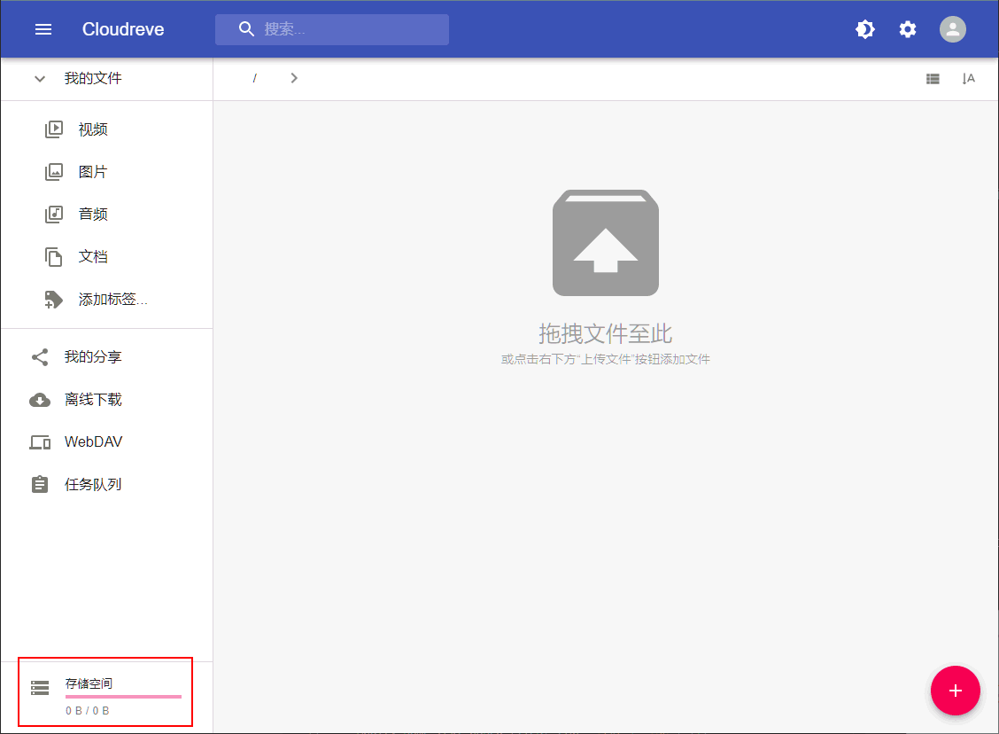
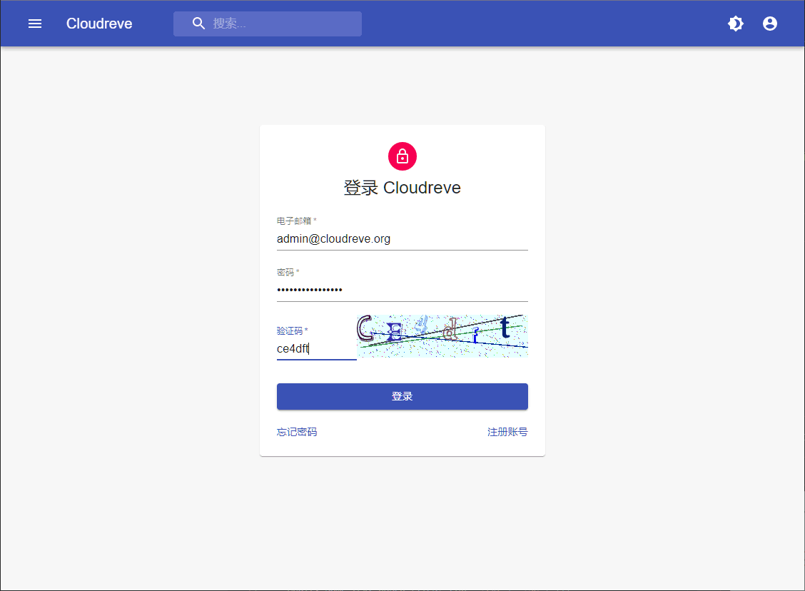
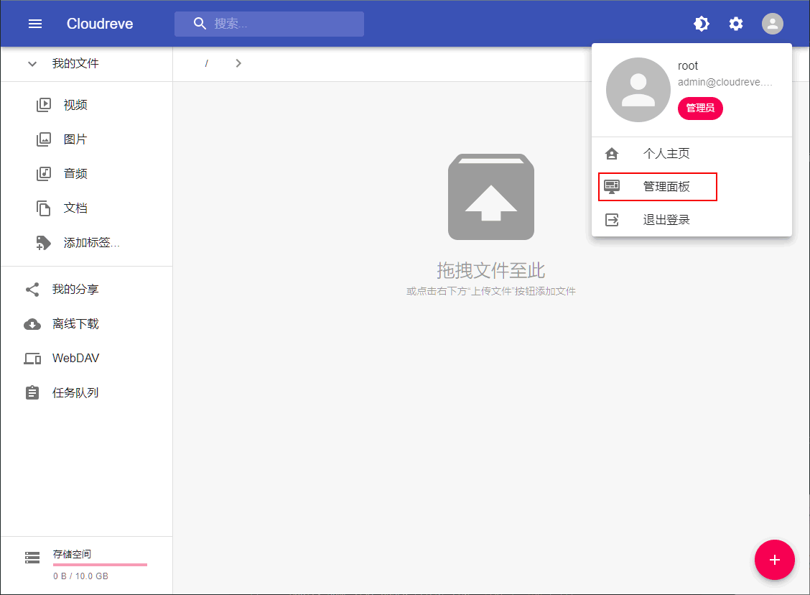
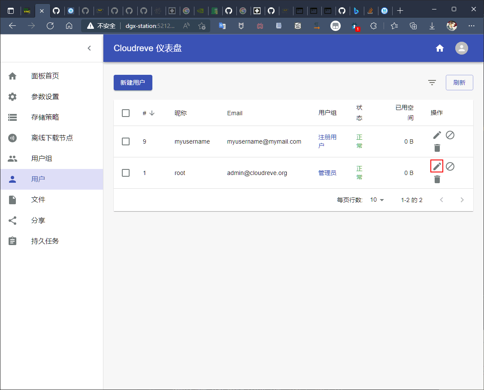
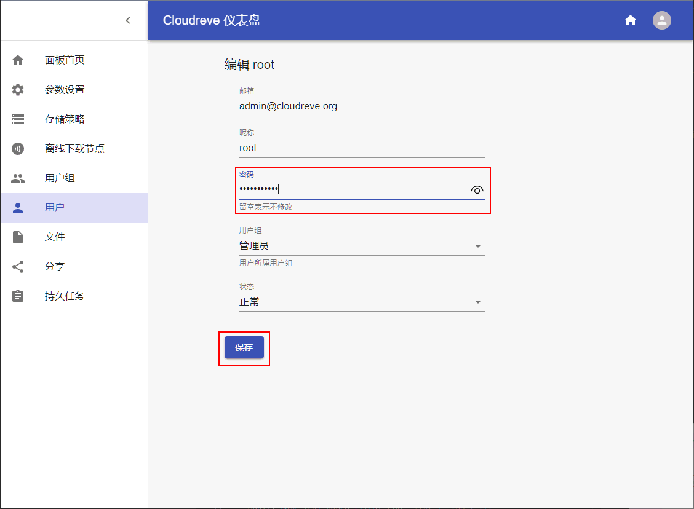
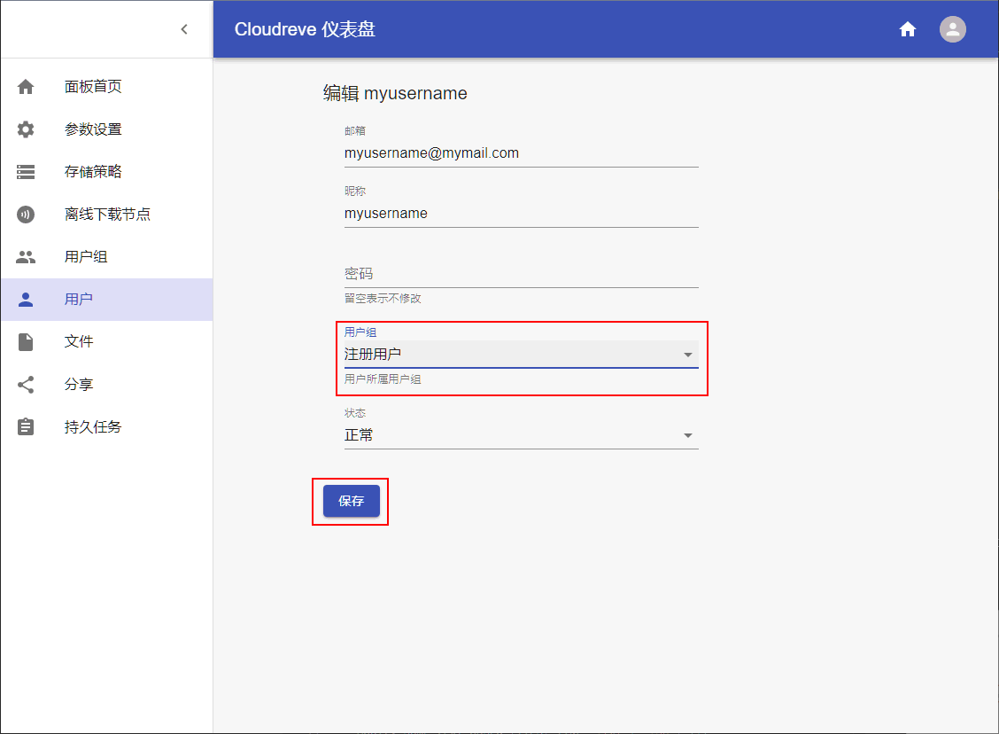
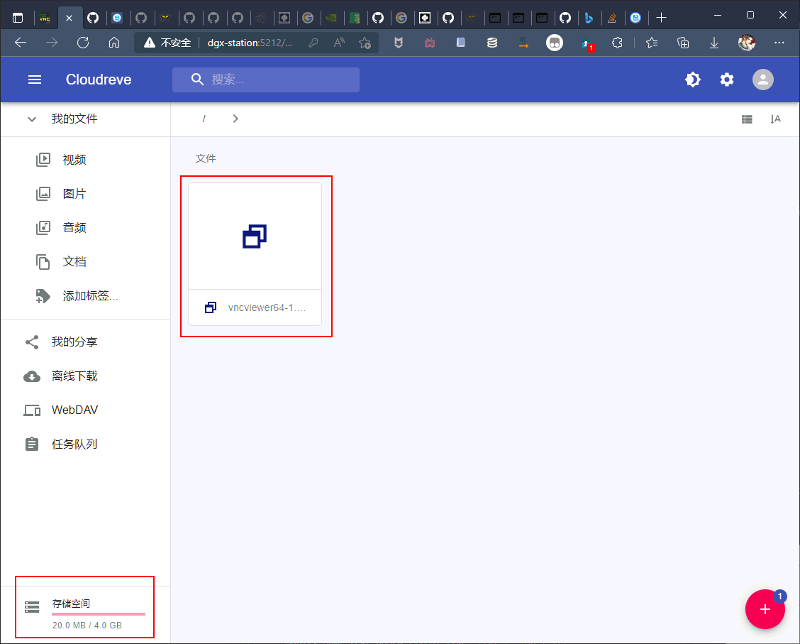
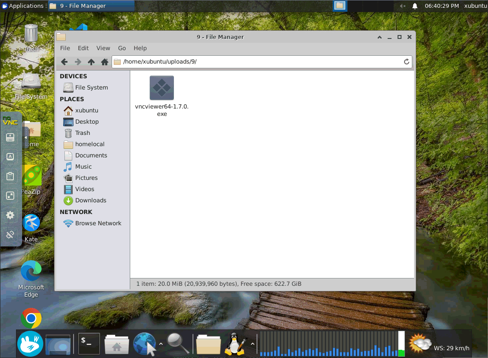
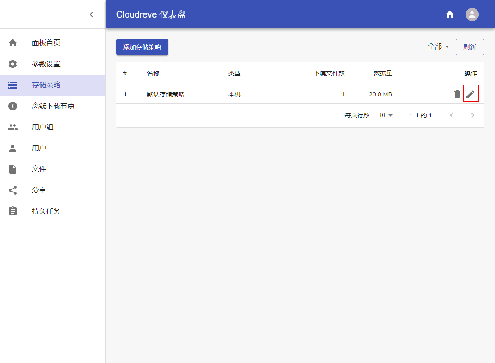
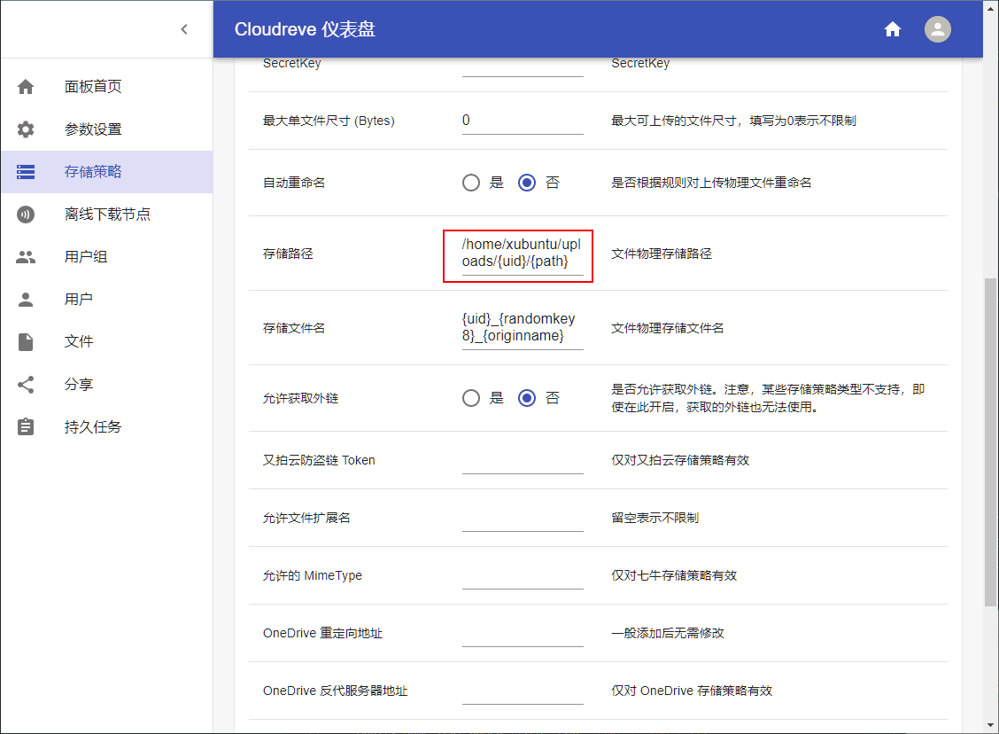

# Dockerfile Collection for DGX-230

To get back to the main page, click [here](../index).

To view the list of image building, click [here](../dockerlist).

To view extra manuals about xUbuntu, click [here](../manual-xubuntu).

## Cloudreve Service

> Updated on 4/19/2022

> :telescope: :construction: This feature is still experimental now. It does not mean that the feature may cause any bug. Actually, it works well. However, for some reasons, it is not a proper alternative of those file exchange clients like WinSCP. If you continue to read this article, your will learn why.

You can find the official website of Cloudreve here:

https://cloudreve.org/

Cloudreve is an online drive service. Compared to FileBrowser, it is more complicated, more powerful, and more secure. However, it only supports **Chinese**.

Now we recommend users to launch their desktop with another port exposed:

```bash
docker run --gpus all -it --rm --shm-size=1g -v ~:/homelocal -v /raid/myname:/data -p 6080:6080 -p 5212:5212 xubuntu:1.7
```

The first `5212` can be modified to another value in case of port occupation. To perform the initial configuration, we recommend users to run the desktop in interactive mode, make the configurations to Cloudreve, and save the image.

After that, users can get into the desktop, start a new terminal, and run

```bash
crpasswd
```

This command will show the initial user name and password of the administrator. Remember the information, then run

```bash
cloudreve
```

It will start another service. If you get access to the desktop by

```markdown
http://xxx.xx.xx.xxx:6080/vnc.html
```

Now you can get access to FileBrowser by

```markdown
http://xxx.xx.xx.xxx:5212/
```

### The initial configuration

This part is very important, because the initial password of the administrator is public, everyone can manage to find it in my source script. So I recommend users to change it.

But before changing or admin password, let us create a user account by registration first:

|  Register a user  |  A new restricted user  |
| :---------------: | :---------------------: |
|  |  |

You can successfully and instantly register the user. However, due to the security issue, a new user is not allowed to upload or download files. Therefore, we can logout and login with our administrator account.

|  Login as an admin   |  Enter the management dashboard  |
| :------------------: | :------------------------------: |
|  |  |

You can verify that you are an admin. Now you can open your management dashboard. In the following steps, we will make some configurations for both the admin account and the user account.

Now we enter the editing page of the admin account,

|  Modify the admin account   |  Modify admin's password  |
| :------------------: | :------------------------------: |
|  |  |

Change a solid password, this password should be kept in your memory. Once you lose it, you may have to drop off all configurations.

After saving the configurations, now we start to edit the user account.

|  Modify the user account   |  Modify user's password  |
| :------------------: | :------------------------------: |
|  |  |

We only need to change the role of the user from a "Provisional User" to a "Registered User". Since the "Registered User" has been verified by the administrator, such user will have 4GB disk space. To verify it, just login with the user account again, and upload a file

|  Upload a file with the user account  |  Check the stored file in your DGX desktop  |
| :------------------: | :------------------------------: |
|  |  |

This file can be verified on your DGX desktop. The default path is `/home/xubuntu/uploads`. But you can modify this path with your admin account,

|  Enter the management dashboard  |  Modify the storage path  |
| :------------------: | :------------------------------: |
|  |  |

Actually, Cloudreve allows you to do more interesting things, like:

* Upload or download a file.
* Preview, move, or delete files on DGX.
* Modify some text-based files, like `.txt`, `.sh`, ...
* Share a file by link. This link can be get access to by anybody in the same LAN.
* Zip / Unzip files.
* Use the offline downloading feature (requires to configure the Aria2 service).

Cloudreve allows the administrators to do more configurations. For example,

* The administrator can ban a user. The banned user will not be able to login.
* The administrator can view all uploaded files and all ongoing tasks.
* The administrator can configure the SMTP email service. After that, the registration will require a verification email.
* The administrator can configure Google reCaptcha, which is more powerful than the default captcha.
* The administrator can configure the Aria2 service, and WebDAV service. Then these features will be enabled.
* The administrator can set a proxy.
* The administrator can change the theme.
* ...

Despite these features, we still recommend users to use FileBrowser, not Cloudreve, because Cloudreve manage the file list in its database. In other words, if you put a file into someone's personal folder from the desktop, it will not actually appear in Cloudreve.

In short, although Cloudreve is powerful, it is more suitable for establishing a centralized service. For example, an administrator can keep a docker container open, where only Cloudreve is running. Then all files are managed by the administrator. All users need to connect the Cloudreve page like a real online disk with their browser, no matter whether they are inside or outside the remote desktop.

### Start Cloudreve together with the desktop

You can specify the argument `--cloudreve` when launching the container. Then the FileBrowser will be opened together with the desktop service:

```bash
docker run --gpus all -it --rm --shm-size=1g -v ~:/homelocal -v /raid/myname:/data -p 6080:6080 -p 5212:5212 xubuntu:1.7 --cloudreve
```

Actually, we recommend users to open Cloudreve always on a terminal inside the desktop. This configuration will help users to control the service better.

> :warning: Do not open Cloudreve and Filebrowser at the same time, unless you know what your are doing and how to configure your ports.
