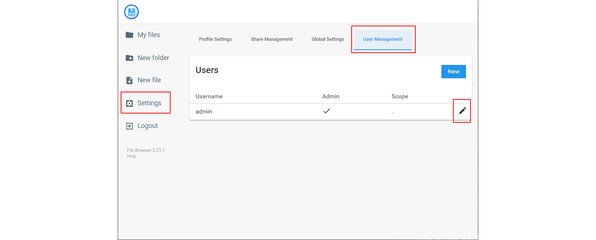
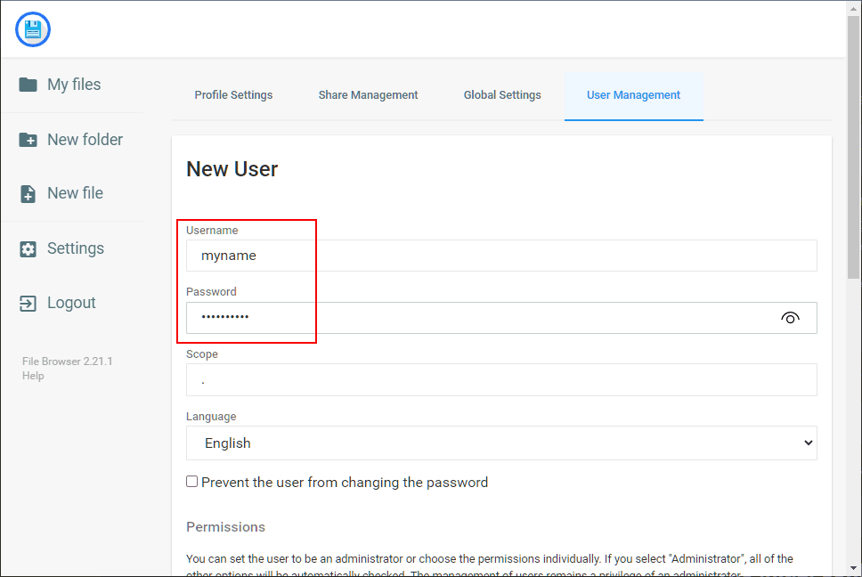
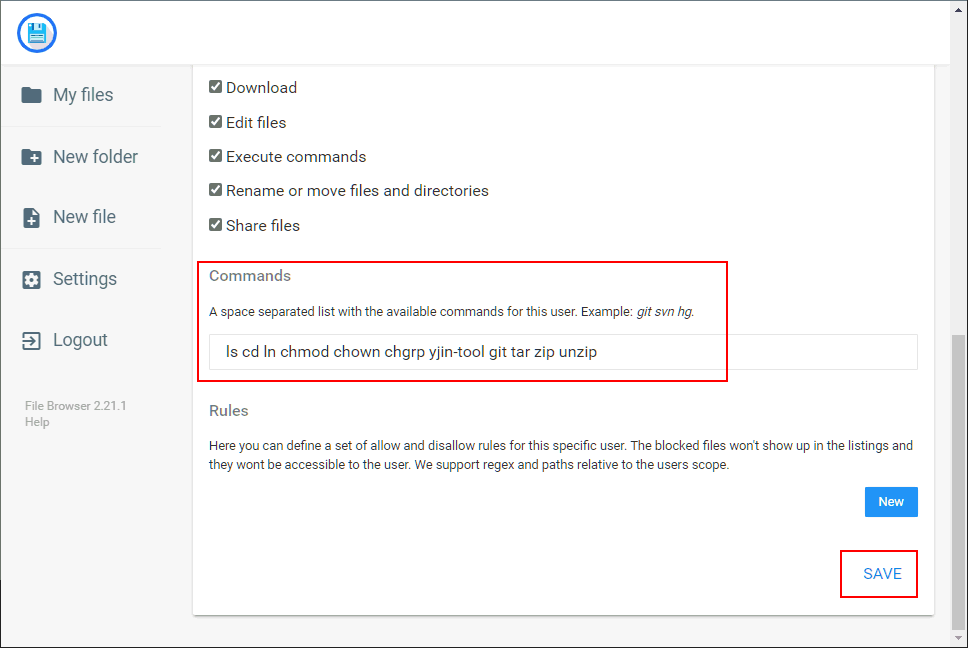
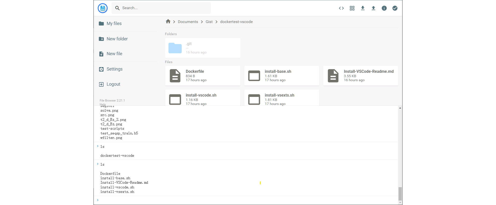

# Dockerfile Collection for DGX-230

To get back to the main page, click [here](../index).

To view the list of image building, click [here](../dockerlist).

To view extra manuals about xUbuntu, click [here](../manual-xubuntu).

## FileBrowser Service

> Updated on 4/19/2022

You can find the official website of FileBrowser here:

[https://filebrowser.org/ :link:](https://filebrowser.org/)

Now we recommend users to launch their desktop with another port exposed:

```bash
docker run --gpus all -it --rm --shm-size=1g -v ~:/homelocal -v /raid/myname:/data -p 6080:6080 -p 5212:5212 xubuntu:1.7
```

The first `5212` can be modified to another value in case of port occupation. To perform the initial configuration, we recommend users to run the desktop in interactive mode, make the configurations to FileBrowser, and save the image.

After that, users can get into the desktop, start a new terminal, and run

```bash
fbrowser
```

It will start another service. If you get access to the desktop by

```markdown
http://xxx.xx.xx.xxx:6080/vnc.html
```

Now you can get access to FileBrowser by

```markdown
http://xxx.xx.xx.xxx:5212/
```

### The initial configuration

This part is very important, because the administrator of FileBrowser has such information:

```markdown
User:     admin
Password: admin
```

It is very unsafe. So you need to log in with the initial password, and enter the user management page, then modify your admin password.

|  User management  |
| :---------------: |
|  |

Then, you can configure your password and allowed commands:

|  Configure password  |  Configure allowed commands  |
| :------------------: | :--------------------------: |
|  |  |

You can also create a new non-admin user, we recommend you to always use this non-admin user for safety issues:

|  Configure password  |  Configure allowed commands  |
| :------------------: | :--------------------------: |
|  |  |

After all, you can login with the non-admin user. Now you can

* Upload or download a file.
* Preview, move, or delete files on DGX.
* Modify some text-based files, like `.txt`, `.sh`, ...
* Share a file by link. This link can be get access to by anybody in the same LAN.
* Use some commands, for example, use `tar` to zip / unzip files.

|   Run a command   |
| :---------------: |
|  |

After finishing the above configurations, you can save your image. Your configurations will be remembered.

> :warning: Note that this command line is not a `bash` commandline. Running a program is OK, but many commands are restricted.

### Run with a different root folder

By default, the root folder of FileBrowser is `/homelocal`. You can also change it to a different path, like `/data`. Just specify the argument like this:

```bash
fbrowser rootdir=/data
```

### Start FileBrowser together with the desktop

You can specify the argument `--filebrowser` when launching the container. Then the FileBrowser will be opened together with the desktop service:

```bash
docker run --gpus all -it --rm --shm-size=1g -v ~:/homelocal -v /raid/myname:/data -p 6080:6080 -p 5212:5212 xubuntu:1.7 --filebrowser fb_rootdir=/data
```

where `fb_rootdir` is the root directory of FileBrowser. If not specified, will use `/homelocal`.

Actually, we recommend users to open FileBrowser always on a terminal inside the desktop. This configuration will help users to control the service better.

> :warning: Do not open Cloudreve and Filebrowser at the same time, unless you know what your are doing and how to configure your ports.

### Explain the `fbrowser` command

The command

```bash
fbrowser rootdir=/data port=5212
```

is just an abbr. of this command:

```bash
USER_ROOT=/home/xubuntu
MACHINE_IP=$(hostname -I | awk 'NR==1 {print $1}')
filebrowser -r /data -a $MACHINE_IP -p 5212 -d "${USER_ROOT}/filebrowser/fb-database.db"
```

The databased used for storing the user information is saved in `/home/xubuntu/filebrowser/fb-database.db`.
